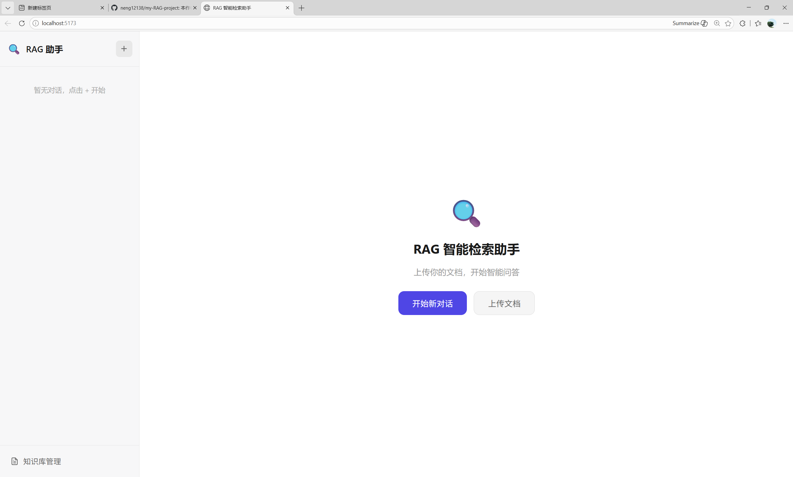
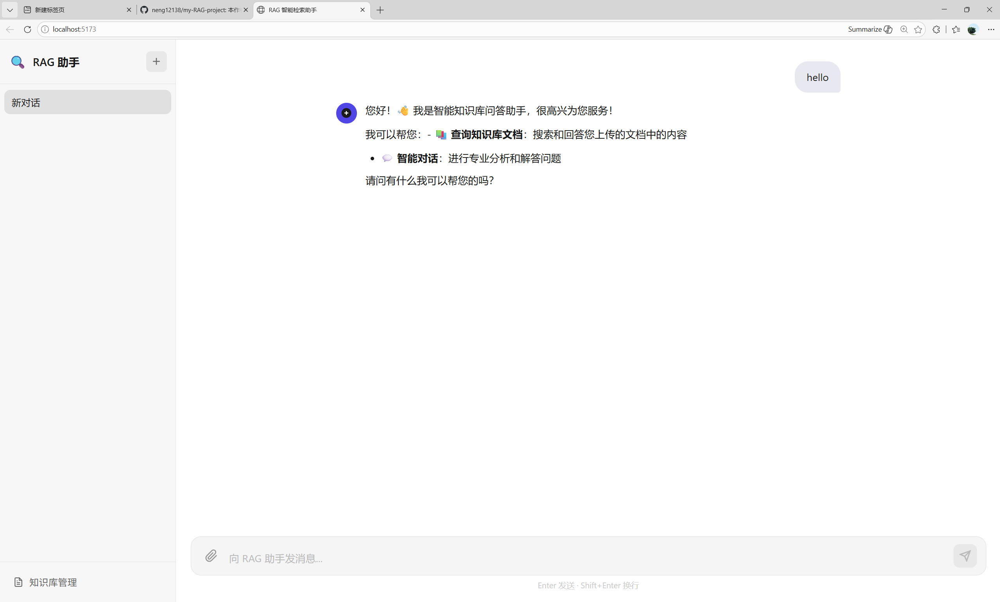
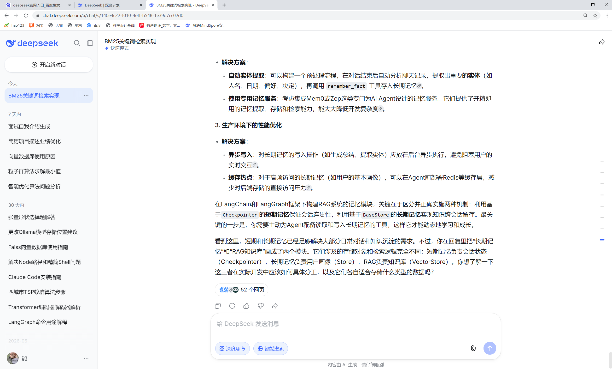

# 项目概况
RAG 智能检索助手是一个基于检索增强生成（Retrieval-Augmented Generation）的智能问答系统。用户上传文档（PDF/TXT/Markdown/Word）后，系统自动将文档向量化并建立索引，用户在对话中提问时，Agent 自动检索知识库中的相关内容，结合大语言模型生成准确、有据可查的回答。

## 核心能力
文档上传与自动处理（分块 → 向量化 → 索引）
智能 Agent 自主决策是否需要检索知识库
混合检索（向量语义检索 + BM25 关键词检索）
重排序精排（阿里云百炼 qwen3-rerank）
流式 SSE 输出（逐 token 实时渲染）
会话管理（多轮对话 + 历史记录持久化）

## 项目架构
```
case01/
│
├── behinder/                       # 【后端 — FastAPI】
│   ├── .env                        # 环境变量（API Key 等敏感信息）
│   └── app/
│       ├── main.py                 # FastAPI 入口（lifespan / router / CORS）
│       ├── core/
│       │   ├── config.py           # 全局配置（读取 .env）
│       │   └── dependencies.py     # 依赖注入（DB Session）
│       ├── services/
│       │   ├── chat_service.py     # 聊天业务逻辑
│       │   └── document_service.py # 文档后台异步处理
│       ├── db/
│       │   ├── base.py             # SQLAlchemy 异步引擎
│       │   ├── models.py           # ORM 模型
│       │   └── crud.py             # 数据库 CRUD
│       └── utils/
│           └── file_utils.py       # 文件上传/验证工具
│
├── agent_rag/                      # 【Agent + RAG 核心模块】
│   ├── agent/
│   │   ├── react_agent.py          # LangGraph ReAct Agent 构建
│   │   └── state.py                # Agent 状态定义
│   ├── tools/
│   │   └── rag_tool.py             # RAG 工具封装
│   ├── rag/
│   │   ├── ingestion/
│   │   │   ├── loader.py           # 多格式文档加载
│   │   │   ├── splitter.py         # 文本分块
│   │   │   └── embedder.py         # 向量化 + Chroma 入库 + BM25 索引
│   │   ├── retrieval/
│   │   │   ├── vector_retriever.py # Chroma 向量检索
│   │   │   ├── bm25_retriever.py   # BM25 关键词检索
│   │   │   └── hybrid_retriever.py # RRF 融合
│   │   ├── rerank/
│   │   │   └── reranker.py         # 重排序
│   │   └── query_transform/
│   │       ├── hyde.py             # HyDE 假设文档生成
│   │       └── multi_query.py      # 多查询扩展
│   └── prompts/
│       ├── agent_prompt.py         # Agent 系统提示词
│       ├── hyde_prompt.py          # HyDE + Multi-Query 提示词
│       └── summarize_prompt.py     # 摘要生成提示词
│
├── fronter/                        # 【前端 — Vue 3 + Vite】
│   ├── package.json
│   ├── vite.config.js              # Vite 配置（API 代理）
│   ├── index.html
│   └── src/
│       ├── main.js                 # Vue 应用入口
│       ├── App.vue                 # 根组件
│       ├── api/
│       │   ├── chat.js             # 会话 API
│       │   └── document.js         # 文档 API
│       ├── stores/
│       │   ├── chatStore.js        # 聊天状态管理
│       │   └── documentStore.js    # 文档状态管理
│       ├── components/
│       └── views/
│           └── HomeView.vue        # 主聊天页面
│
└── data/                           
    ├── app.db                      # SQLite 数据库
    ├── chroma/                     # Chroma 向量库持久化
    ├── bm25/                       # BM25 索引序列化
    └── uploads/                    # 上传的原始文件
```

## ReAct Agent 工作流
```
用户提问
    │
    ▼
[Agent Node]  LLM 思考 (Thought)
    │
    ├── 需要检索 ──> [rag_search_and_summarize Tool]
    │                    ├── HyDE 查询改写
    │                    ├── 混合检索 (向量 + BM25)
    │                    ├── RRF 融合
    │                    ├── 重排序
    │                    └── 摘要生成
    │                    │
    │                    └──> 返回摘要 (Observation)
    │                         │
    │                         └──> 回到 Agent Node (再次思考)
    │
    └── 直接回答 ──> [最终回答] (SSE 流式输出)
```

## 运行展示




## 关键设计特点
| 特点 | 说明 |
|------|------|
| **ReAct Agent** | Agent 自主决策是否检索，适应混合场景 |
| **HyDE 增强** | LLM 生成假设答案提升向量检索召回率 |
| **混合检索** | BM25 + 向量双路召回，RRF 融合互补 |
| **重排序** | qwen3-rerank API 精排，失败自动降级 |
| **异步全链路** | FastAPI async + httpx + asyncio.create_task，全程非阻塞 |
| **流式 SSE** | agent.astream_events v2 实现逐 token 输出 |
| **Agent 预热** | lifespan 中提前构建，避免首次请求延迟 |
| **增量索引** | BM25 新文档追加合并，支持累积索引 |
| **安全防护** | XSS 过滤 + 消息校验 + 文件格式白名单 |
| **路径自适应** | 所有路径基于 `__file__` 动态计算，clone 即用 |

## 启动方式

```bash
# 1. 安装依赖
cd behinder
pip install -r requirements.txt

cd fronter
npm install

# 2. 配置环境变量
编辑 behinder/.env，填入 API Key

# 3. 启动后端 (终端 1)
cd behinder
uvicorn app.main:app --host 127.0.0.1 --port 8000 --reload

# 4. 启动前端 (终端 2)
cd fronter
npm run dev

# 5. 访问 http://localhost:5173
```
#### 声明
作者使用的是阿里云的api_key，用户若想使用其他的模型只需配置一下env文件中的api_key和model即可
